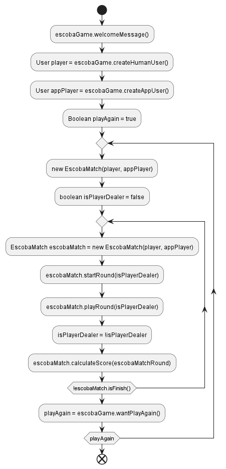

### La Escoba de 15

  

Bienvenido a "La Escoba de 15", un emocionante proyecto desarrollado en Java que simula el tradicional juego de cartas español "La Escoba". Este proyecto no solo pone a prueba habilidades de programación, sino que también proporciona una plataforma divertida y educativa para jugar y entender este clásico juego de cartas.

#### Objetivo del Proyecto
El objetivo principal de este proyecto es construir una aplicación de consola que permita a una persona jugar a "La Escoba de 15" contra la máquina. El juego se desarrolla utilizando una baraja española de 40 cartas y sigue las reglas tradicionales, con algunas adaptaciones para la interacción con la máquina.

#### Funcionalidades Principales

1. **Interfaz de Usuario Intuitiva**: La aplicación inicia con un mensaje de bienvenida y solicita el nombre del jugador, proporcionando una experiencia amigable desde el principio.
2. **Simulación del Juego**: Dos jugadores, uno humano y la máquina, compiten para sumar 15 puntos mediante la recolección de cartas que sumen exactamente 15.
3. **Estrategia de Juego Avanzada**: La máquina sigue una serie de reglas estratégicas para desafiar al jugador humano, incluyendo la priorización de cartas específicas y el manejo inteligente de sus jugadas.
4. **Estado del Juego**: Durante cada turno, el programa muestra el estado actual del juego, incluyendo las cartas en la mano del jugador, las cartas en la mesa y las cartas recolectadas.
5. **Recuento de Puntos**: Al final de cada ronda, se muestra un recuento detallado de los puntos, destacando los motivos de suma y el total acumulado.
6. **Determinación del Ganador**: El juego continúa hasta que uno de los jugadores alcanza 15 puntos, momento en el cual se declara el ganador.

#### Tecnologías Utilizadas

- **Java**: El lenguaje principal utilizado para desarrollar la lógica del juego.
- **JUnit**: Utilizado para las pruebas unitarias que aseguran la funcionalidad y la estabilidad del código.
- **Mockito**: Utilizado para crear objetos simulados en las pruebas unitarias, lo que facilita la prueba de componentes individuales en aislamiento.
- **GitHub**: Para el control de versiones y la colaboración en el desarrollo del proyecto.

#### Arquitectura del Proyecto

El proyecto está estructurado de manera modular, con clases bien definidas que representan los distintos componentes del juego. Esto incluye:

- **EscobaGame**: Controla la ejecución de múltiples partidas y gestiona la interacción con el usuario.
- **User**: Representa a los jugadores, tanto humano como la máquina.
- **RoundPlayer**: Control del estado de las cartas en la mano, el montón de cartas recolectadas y los puntos.
  - **HumanRoundPlayer**: Implementación específica para el jugador humano.
  - **AppRoundPlayer**: Implementación específica para el jugador de la aplicación.
- **EscobaMatch**: Maneja una partida completa, que puede incluir múltiples rondas.
- **EscobaMatchRound**: Maneja una ronda dentro de una partida, donde se juegan múltiples manos hasta que se agota el mazo.
- **Deck**: La baraja de cartas española de 40 cartas.
- **Card**: Representación de cada carta, con su número y valor.
- **CardSuit**: Enumera los diferentes palos de la baraja (oros, copas, espadas, bastos).

  

#### Desarrollo y Pruebas

El código incluye múltiples puntos de integración y pruebas unitarias para asegurar su correcto funcionamiento. Los métodos y clases clave están diseñados para ser fácilmente comprensibles y mantenibles, facilitando futuras expansiones y modificaciones. Las pruebas unitarias con JUnit y Mockito aseguran que cada componente funcione como se espera, incluso cuando se prueba de manera aislada.

#### Impacto del Proyecto

Este proyecto muestra una aplicación compleja de habilidades técnicas en Java y principios de diseño de software, con un enfoque en la creación de una experiencia de juego interactiva y atractiva. Es una demostración efectiva de la capacidad para desarrollar aplicaciones de consola que requieren una lógica de juego sofisticada y una interacción detallada con el usuario. Además, resalta la importancia de escribir código limpio y mantenible, así como la aplicación de pruebas unitarias para asegurar la calidad y fiabilidad del software.
